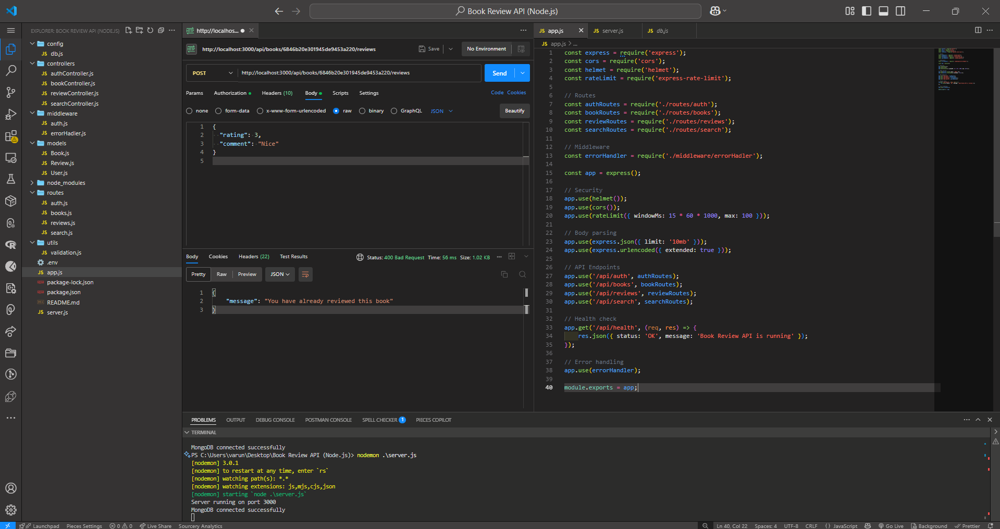

# 📚 Book Review API

A RESTful API for managing books and reviews—built with Node.js, Express, MongoDB, and JWT authentication.

---

## 🚀 Features

- **User Management**

  - Sign up & log in via JWT
  - Password hashing with bcrypt

- **Book Operations**

  - Add, list, filter & paginate books
  - View detailed book info with average ratings & review counts

- **Review System**

  - Submit, update & delete one review per book
  - Rating (1–5) and comment limits

- **Search**

  - Full-text search on title & author
  - Pagination & result metadata

- **Security**

  - HTTP headers hardening with Helmet
  - CORS support
  - Rate limiting (100 requests / 15 min)

- **Validation**
  - Joi schemas for request payloads

---

## 📸 Screenshots

### 📚 Book Review API Working



---

## 🔧 Getting Started

### 1. Clone & Install

```bash
git clone https://github.com/VarunSingh19/book-review-api.git
cd book-review-api
npm install
```

### 2. Configure

1. Copy `.env.example` → `.env`
2. Fill in your values:

   ```env
   NODE_ENV=development
   PORT=3000
   MONGODB_URI=mongodb://localhost:27017/bookreview
   JWT_SECRET=<your_jwt_secret>
   ```

### 3. Run

- **Development**

  ```bash
  npm run dev
  ```

- **Production**

  ```bash
  npm start
  ```

The API will be available at `http://localhost:3000/api`.

---

## 📖 API Reference

### Auth

- **POST** `/api/auth/signup`
  Request body:

  ```json
  {
    "username": "johndoe",
    "email": "john@example.com",
    "password": "secret123"
  }
  ```

  Response: `201 Created`

- **POST** `/api/auth/login`

  ```json
  {
    "email": "john@example.com",
    "password": "secret123"
  }
  ```

  Response: `200 OK` + `{ token }`

### Books

- **GET** `/api/books?page=1&limit=10&author=tolkien&genre=fantasy`
- **GET** `/api/books/:id`
- **POST** `/api/books` _(Auth)_

  ```json
  {
    "title": "The Hobbit",
    "author": "J.R.R. Tolkien",
    "genre": "Fantasy",
    "description": "...",
    "publishedYear": 1937,
    "isbn": "9780261102217"
  }
  ```

### Reviews

- **POST** `/api/books/:id/reviews` _(Auth)_

  ```json
  { "rating": 5, "comment": "A timeless classic!" }
  ```

- **PUT** `/api/reviews/:id` _(Auth)_
- **DELETE** `/api/reviews/:id` _(Auth)_

### Search

- **GET** `/api/search?q=hobbit&page=1&limit=5`

---

## 🔄 Response Structure

All list endpoints return:

```json
{
  "data": [
    /* items */
  ],
  "pagination": {
    "currentPage": 1,
    "totalPages": 3,
    "totalItems": 25,
    "hasNextPage": true,
    "hasPrevPage": false
  }
}
```

Detailed endpoints embed related data (e.g., `averageRating`, `reviewCount`, `user`).

---

## 🛠️ Tech Stack

- **Server:** Node.js, Express
- **DB:** MongoDB, Mongoose
- **Auth:** JWT, bcrypt.js
- **Validation:** Joi
- **Security:** Helmet, CORS, Rate-Limit

---

## 🙌 Contributing

1. Fork this repo
2. Create a feature branch (`git checkout -b feature/foo`)
3. Commit your changes (`git commit -m "feat: add foo"`)
4. Push to branch (`git push origin feature/foo`)
5. Open a Pull Request

Please follow the existing code style and add tests for new features.

---
